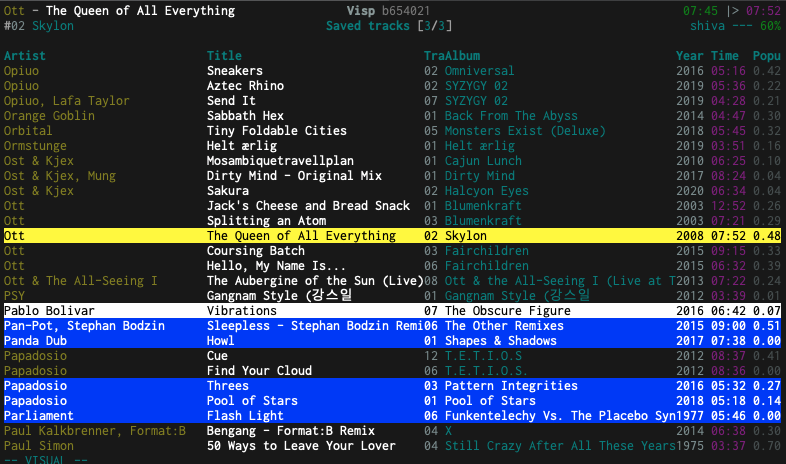

# Visp

[](https://goreportcard.com/report/github.com/ambientsound/visp)
[](https://codecov.io/gh/ambientsound/visp/branch/master)
[](LICENSE)

Visp is an interactive console client for [Spotify](https://www.spotify.com), written in Go. Its interface is similar to Vim, and aims to be fast, configurable, and practical.

This project is a fork of the [Practical Music Search](https://github.com/ambientsound/pms) project and contains a lot of the same functionality,
and is geared towards Spotify instead of Music Player Daemon. Due to signififact differences between the Spotify and MPD APIs, a new client was created
instead of modularizing the former. Also, the fork is a convenient opportunity to depart from the unfortunate acronym _PMS_.

Visp has many features that involve sorting, searching, and navigating. It’s designed to let you navigate your music collection effectively and efficiently.

Among currently implemented features are:

* Looks and feels like Vim!
* Can be configured to consume a very small amount of screen space.
* MPD player controls: play, add, pause, stop, next, prev, volume.
* A fully customizable layout, including player status, tag headers, text styles, colors, and keyboard bindings.
* Full access to all your private and public Spotify playlists and liked songs.
* Many forms of tracklist manipulation, such as select, cut, copy, paste, filter, sort, etc.
* Text configuration files, tab completion, history, and much more!

## Screenshot




## Documentation

[Documentation](doc/README.md) is available in the project repository.


## Project status

Visp is _beta software_ and is a work in progress. Testers are welcome.


## Developing

You’re assumed to have a working [Go development environment](https://golang.org/doc/install). Building PMS requires Go 1.16 or higher.

Assuming you have the `go` binary in your path, you can build Visp using:

```
git clone https://github.com/ambientsound/visp
cd pms
make
```

This will put the binary in `./visp`.
You need to run Visp in a regular terminal with a TTY.

If Visp crashes, and you want to report a bug, please include relevant sections of the `debug.log` file,
located in the directory where you started Visp.


## Requirements

Visp requires a Spotify Premium account and will not work with free accounts.

PMS is multithreaded and benefits from multicore CPUs.


## Contributing

See [how to contribute to PMS](CONTRIBUTING.md).


## Authors

Forked from [Practical Music Search](https://github.com/ambientsound/pms), written by Kim Tore Jensen <<kimtjen@gmail.com>>, Bart Nagel <<bart@tremby.net>>, and others.

Visp is written by Kim Tore Jensen <<kimtjen@gmail.com>>.

The source code and latest version can be found at Github:
<https://github.com/ambientsound/visp>.
